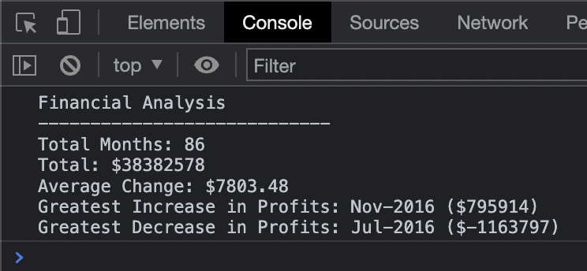

# Challenge 04 JavaScript Fundamentals: Console Finances

## Description

For this project we were required to use our newly acquired JavaScript knowledge and create a code which will analyse the financial records for a company.

The analysis needed to include the following:
* The total number of months included in the dataset.
* The net total amount of Profit/Losses over the entire period.
* The average of the **changes** in Profit/Losses over the entire period.
    *  Track what the total change in profits is from month to month and then find the average.
    *  (`Total/Number of months`)
* The greatest increase in profits (date and amount) over the entire period.
* The greatest decrease in losses (date and amount) over the entire period.

## Usage

The following image shows the application's functionality:

## Links

* [Deployed application.](https://agh911.github.io/Console-Finances/)

## Credits

* [Finding the sum of an array.](https://www.w3docs.com/snippets/javascript/how-to-find-the-sum-of-an-array-of-numbers.html)
* [Calculating the net change.](https://www.cuemath.com/net-change-formula/)
* [Rounding to two decimals.](https://www.tutorialspoint.com/How-to-format-a-number-with-two-decimals-in-JavaScript)
* [GitHub Badges.](https://shields.io/)

## License

This project is licensed under the MIT License - see the LICENSE.md file for details.

---

AG © 2022
